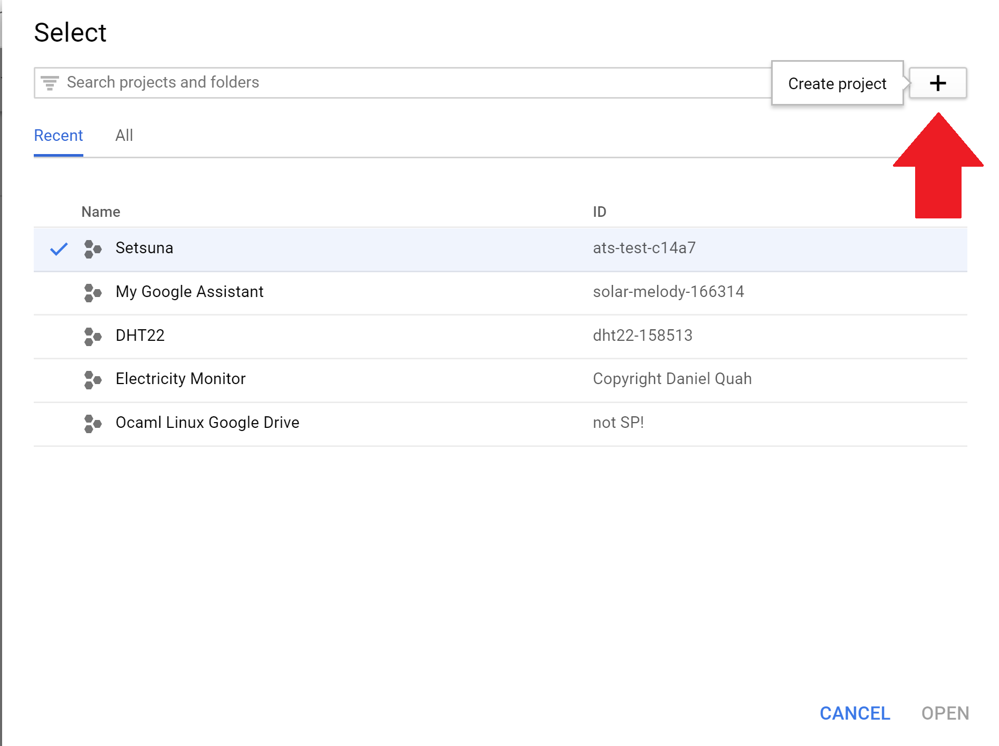
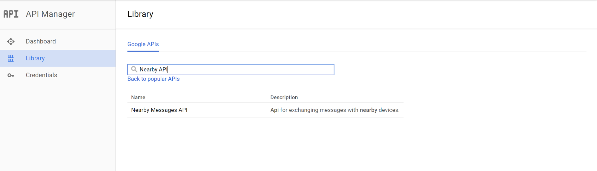
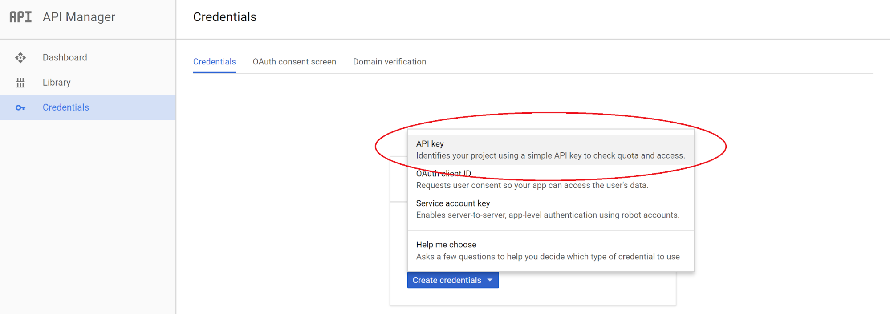
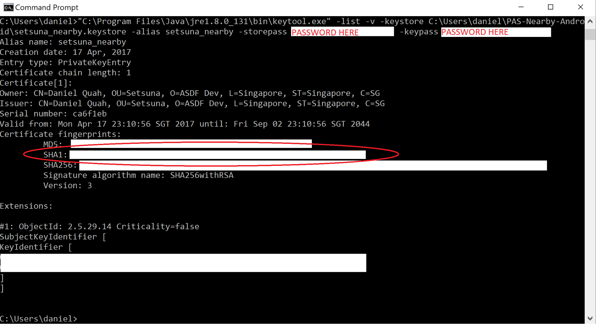
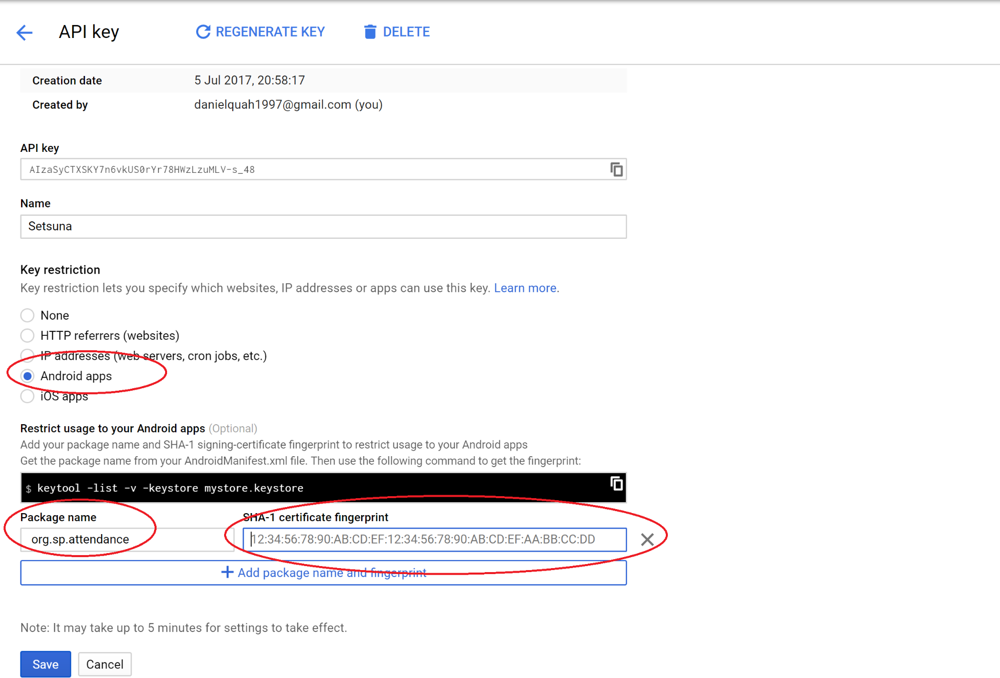
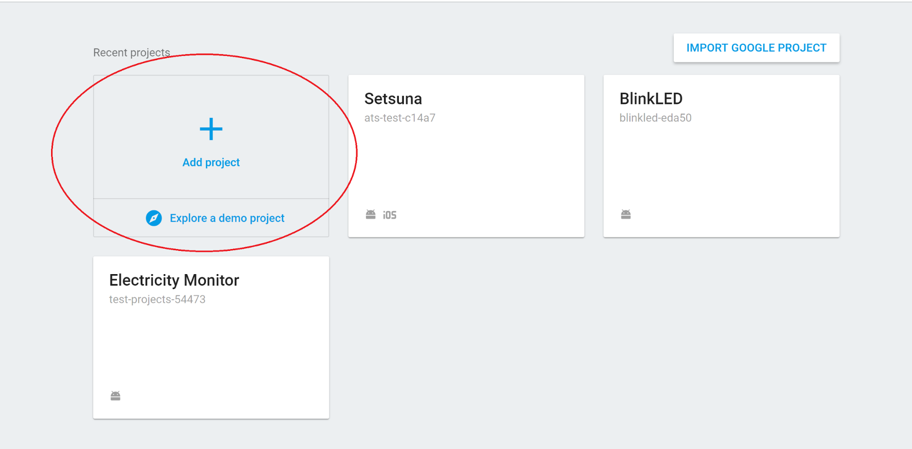
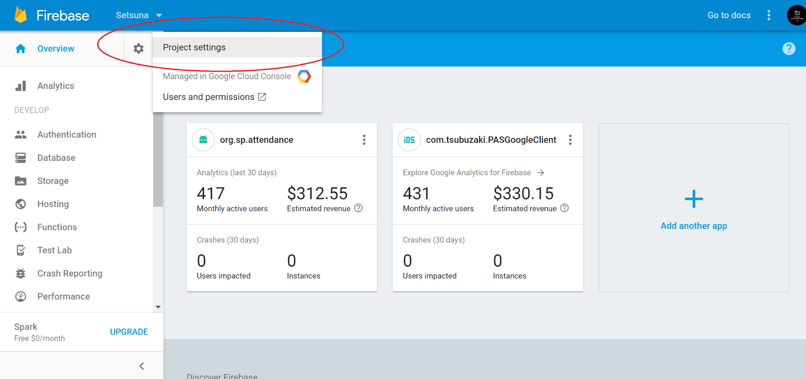
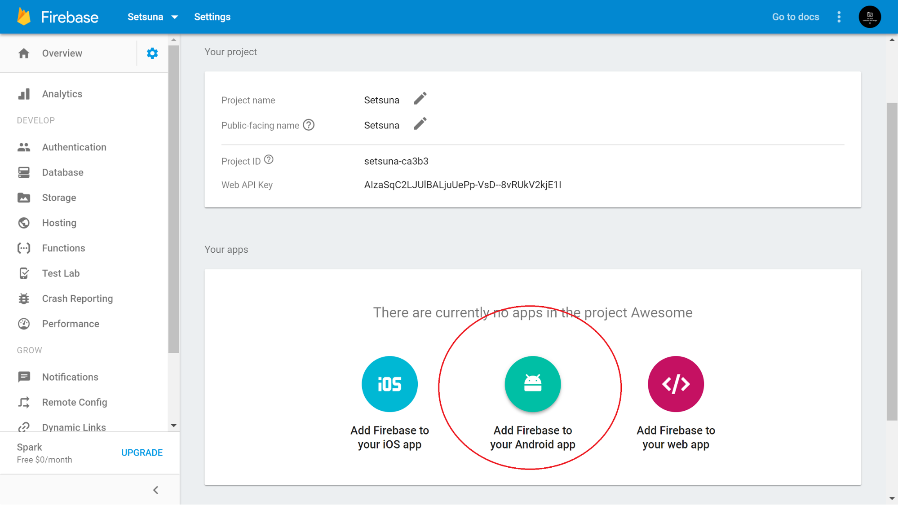

Getting Started
-----------------

This software has a dependency on Google Play Services(Firebase and Nearby API). Therefore, we will need a Firebase project setup and Google Nearby API key.

**Nearby**
-------------

1. Create a project on Google Developer Console 

2. Search for `Nearby Messages API`

3. Click on `Nearby Messages API` and Enable Nearby Messages API

4. Click on `Create Credentials` and click on `API key`

5. Open Command Prompt (CMD) and type in the following command.
`keytool -genkey -v -keystore setsuna_nearby.keystore -alias setsuna -keyalg RSA -keysize 2048 -validity 10000`

6. Enter the required fields. They can be anything you want. Remember the password since it is _irrecoverable_ if forgotten.

7. Next, enter the following command to find your SHA1 certificate fingerprint
`keytool -list -v -keystore setsuna_nearby.keystore -alias setsuna -storepass *PasswordAtStep6* -keypass *PasswordAtStep6* `

On systems with GNU coreutils installed, you can sanitise the output:
`keytool -list -v -keystore setsuna_nearby.keystore -alias setsuna -storepass *PasswordAtStep7* -keypass *PasswordAtStep7* | grep SHA1 | sed -e 's/^[[:space:]]*//' | cut -c7- `
(If you are using Windows, you probably do not have GNU coreutils installed.)

8. You should see a line in the output similar to SHA1:ajsdhakshqh23123hajd9790

9. Go back to Google Developer console. Pick `Android apps`. Then register your Android app’s SHA1 certificate fingerprint (that you obtained in step 7) and package name for your app. Use `org.sp.attendance` for the package name. 

10. Copy the API key generated and paste it in a file named gradle.properties at the root of the project directory.

A sample of the file is in [material/gradle.properties.sample](material/gradle.properties.sample) .The setup for Nearby API is done. Next, we will be getting the google-services.json file from Firebase.

**Firebase**
---------------

1. Create a new project on Firebase Developer Console. (https://console.firebase.google.com/)

2. Click on Add Project

3. Put `Setsuna` as the name and _your country_ as the region.

4. Click on the gear icon at the top left and click on Project settings.

5. Click on `Add Firebase to your Android App`.

6. Add `org.sp.attendance` in Android Package Name field.

7. Click on `Register App`

`google-services.json` file will be downloaded. Copy the file to $$PROJECT_ROOT/app/  directory.

Start building!