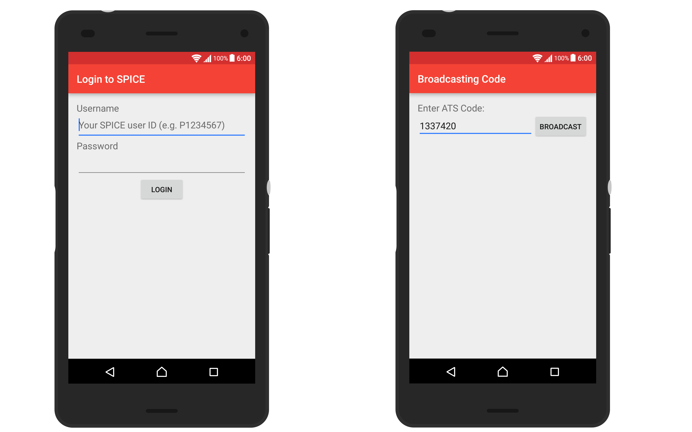
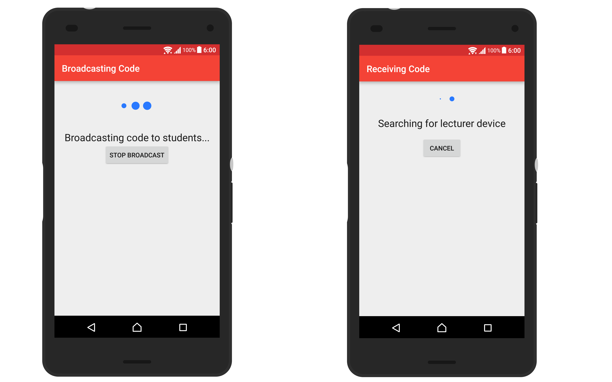
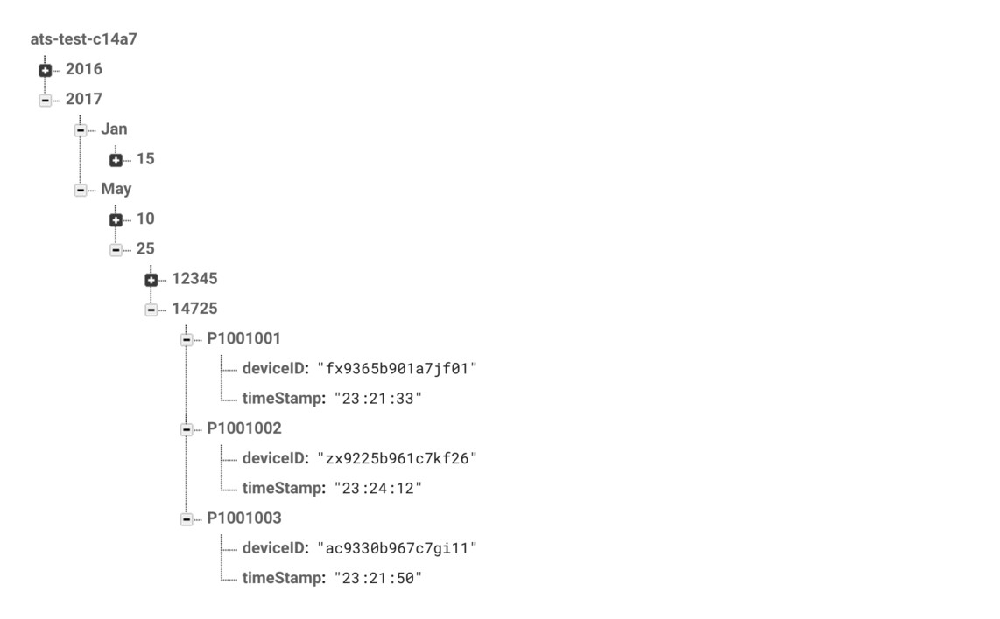

# PAS-Nearby-Android

Presence checking using Nearby API

*Designed to improve the current Attendance Taking System(ATS) used in Singapore Polytechnic.*

For some background information on this project, please see this [link](https://asdfdev.github.io/background.html)

# Screnshots




	
Please see [GettingStarted.md](GettingStarted.md) for information on building this project. 

TODO
------------
- Use fragment instead of starting activities for lecturer interface. 


Team members
------------
1. Daniel Quah
1. Justin Xin

**Special thanks to Mr. Teo Shin Jen for the help in this project. This project would not be possible without him.**


### License
```
Copyright 2016-2017 Daniel Quah and Justin Xin

This file is part of org.sp.attendance
 
ATS_Nearby is free software: you can redistribute it and/or modify
it under the terms of the GNU General Public License as published by
the Free Software Foundation, either version 3 of the License, or
(at your option) any later version.
 
ATS_Nearby is distributed in the hope that it will be useful,
but WITHOUT ANY WARRANTY; without even the implied warranty of
MERCHANTABILITY or FITNESS FOR A PARTICULAR PURPOSE.  See the
GNU General Public License for more details.

```
