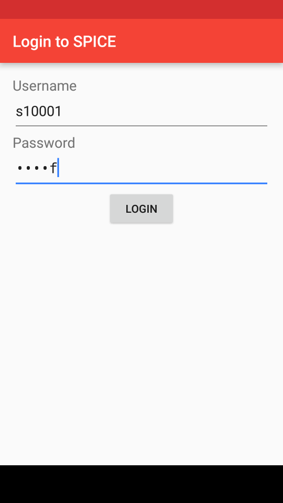
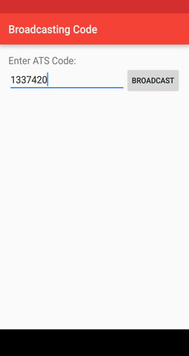
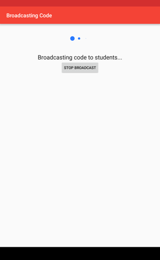
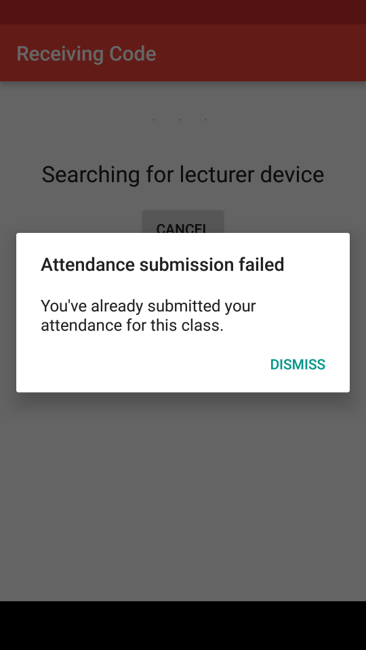

# ATS_Nearby
Presence checking with Nearby API for SP ATS

The code cannot be compiled straight from source as it is missing 2 things: - Google API Key
																			- google-services.json

*Designed to improve the current Attendance Taking System(ATS) used in Singapore Polytechnic.*

ATS_Nearby is a solution to improve the flaws in the current ATS. As of writing, there are multiple flaws in the ATS, such as student commiting attendance fraud(helping classmate to submit attendance when not in class.) and
not checking if the same device has been used to submit attendance. This project was inspired from a Straits Times
article, [Poly's app attendance system stirs concerns](http://www.straitstimes.com/singapore/education/polys-app-attendance-system-stirs-concerns). [MIRROR LINK](https://web.archive.org/web/20160730032416/http://www.straitstimes.com/singapore/education/polys-app-attendance-system-stirs-concerns).


# Screnshots






Solution used:

1. Check for WiFi SSID to ensure that Student is actually in campus ground before allowing student to sign into the system.
1. Check to ensure that student is in class by using near-ultrasound.
1. Check to ensure that the device used by student has not been used to submit attendance for the past 30 minutes. 

For more information, please take a look at our [powerpoint slides](materials/Revamping the Attendance Taking System.pptx)
	
Getting Started
---------------

1. Create a project on
[Google Developer Console](https://console.developers.google.com/). 

1. Click on `APIs & auth -> APIs`, and enable `Nearby Messages API`.

1. Click on `Credentials`, then click on `Create new key`, and pick
`Android key`. Then register your Android app's SHA1 certificate
fingerprint and package name for your app. Use
`org.sp.attendance`
for the package name.

1. Copy the API key generated, and paste it in `gradle.properties` file.

So, your file should have this line `AppKey=1337shamaladingdong420`.

1. Create a new project on [Firebase Developer Console](https://console.firebase.google.com/).
1. Click on `Add Firebase to your Android app`. Enter `org.sp.attendance` for the package name and click next.
1. `google-services.json` will be downloaded. Put the file in under ATS_Nearby/app

# IMPORTANT NOTE: 
Date: 20/10/2016 

Firebase sdk version: 9.0.0

Error output: Missing api_key/current_key object

Bug: In `google-services.json`, the "api_key:[]" field is empty.

Solution: Manually add your api key in. Your end result will look similar to "api_key: [ { 1337shamaladingdong420 } ]"

[Link to solution on stackoverflow](http://stackoverflow.com/questions/37317295/missing-api-key-current-key-with-google-services-3-0-0).

Start building!


Team members
------------
1. Daniel Quah
1. Justin Xin

**Special thanks to Mr. Teo Shin Jen for the help in this project. This project would not be possible without him.**


### License
```
Copyright 2016 Daniel Quah and Justin Xin

This file is part of org.sp.attendance
 
ATS_Nearby is free software: you can redistribute it and/or modify
it under the terms of the GNU General Public License as published by
the Free Software Foundation, either version 3 of the License, or
(at your option) any later version.
 
ATS_Nearby is distributed in the hope that it will be useful,
but WITHOUT ANY WARRANTY; without even the implied warranty of
MERCHANTABILITY or FITNESS FOR A PARTICULAR PURPOSE.  See the
GNU General Public License for more details.

```